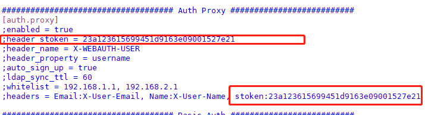

#### pdfh5

> 基于pdf.js和jQuery，web/h5/移动端PDF预览手势缩放插件。

- [pdfh5](https://github.com/gjTool/pdfh5)

#### clipboard

> 将文本复制到剪贴板的现代方案，没有Flash。没有框架。gzip压缩后仅有3kb。

- [clipboard](https://clipboardjs.com)

#### swiper

> 强大的内容触摸滑动插件

- [swiper](https://www.swiper.com.cn)

#### html2canvas

> Screenshots with JavaScript

- [html2canvas](https://html2canvas.hertzen.com)

#### grafana

> Grafana是一个跨平台的开源的分析和可视化工具，可以通过将采集的数据查询然后可视化的展示，并及时通知。

- [文档](https://grafana.com/docs/)
- [版本](https://grafana.com/grafana/download)
- 环境：centos7

##### 安装

```bash
wget https://dl.grafana.com/enterprise/release/grafana-enterprise-8.2.5-1.x86_64.rpm
yum install grafana-enterprise-8.2.5-1.x86_64.rpm
yum clean all
```


##### 启动

```bash
systemctl enable grafana-server
systemctl start grafana-server
```

##### 访问

- 默认3000端口：http://localhost:3000
- 默认用户名和密码，都是admin

##### 配置文件

配置文件位置：`/etc/grafana/grafana.ini`

!> 数据源地址添加访问header，可配置 `Auth Proxy` 项：



