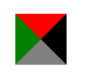

## 重绘和回流（重排）

- 常见引起重排属性和方法

width | height  |  margin  |  padding |  display
-----|:-----:|:-----:|:-----:|-----
border-width | border |position |overflow|font-size
vertical-align| min-height | clientWidth|clientHeight|clientTop
clientLeft| offsetWudth |offsetHeight |offsetTop|offsetLeft
scrollWidth| scrollHeight |scrollTop |scrollLeft|scrollIntoView()
scrollTo()| getComputedStyle() |getBoundingClientRect() |scrollIntoViewIfNeeded()|

- 常见引起重绘的属性

color | border-style  |  visibility  |  background |  text-decoration
-----|:-----:|:-----:|:-----:|-----
background-image | background-position |background-repeat |outline-color|outline
outline-style| border-radius | outline-width|box-shadow|background-size

**重点：**

1. 回流必定会触发重绘，重绘不一定会触发回流。重绘的开销较小，回流的代价较高。
2. 重绘和回流都影响页面的响应速度
3. 重绘和回流是无法避免的
4. 重绘和回流这个问题只能优化，不能解决
5. 任何的DOM操作都会引发回流

**JavaScript避免回流的方法：**

1. 避免频繁操作样式，最好一次性重写style属性，或者将样式列表定义为class并一次性更改class属性。
2. 避免频繁操作DOM，创建一个documentFragment，在它上面应用所有DOM操作，最后再把它添加到文档中。
3. 也可以先为元素设置display: none，操作结束后再把它显示出来。因为`在display属性为none的元素上进行的DOM操作不会引发回流和重绘`。
4. 避免频繁读取会引发回流/重绘的属性，如果确实需要多次使用，就用一个变量缓存起来。
5. 对具有复杂动画的元素使用绝对定位，使它脱离文档流，否则会引起父元素及后续元素频繁回流。

## 生成BFC

> 生成独立容器，容器与容器、容器内的元素与容器相互不影响。

```css
根元素html

float属性不为none

position为absolute或fixed

display为inline-block, flex, inline-flex, table-cell, table-caption

overflow不为visible
```

1. 防止浮动覆盖
2. 清除内部浮动
3. 防止margin重叠

## 布局

### box和flex用法对比

```css
display:-webkit-box
display:flex

-webkit-box-orient:row,column
flex-direction:row,column

-webkit-box-align:start,end,center
align-item:flex-start,flex-end,center,stretch

-webkit-box-pack:start,end,center
justify-content:flex-start,flex-end,center,space-between
```

### 撑满全屏

```css
position: absolute;
z-index: 1;
left: 0;
right: 0;
width: calc(100%);
height: calc(100%); 
```

### 元素居中

```css
/* 绝对定位方式 */
position: absolute;
left: 50%;
top: 50%;
transform: translate(-50%, -50%);
```

### 去掉input默认样式
```css
input {
    background:none;  
    outline:none;  
    border:none;
}
```

### 防止页面加载图片抖动
```css
.product-img {
    
    /*  =====核心代码 start=====  */
    overflow:hidden;
    height:0;
    padding-bottom:*;  /*  其中*处填 图片的高宽百分比=高/宽*100%  */
    /*  =====核心代码 end=====  */

    img {
        width:100%;
    }
}
```

## BaseCss

```css
html,body,form,fieldset,p,div,ul,h1,h2,h3,h4,h5,h6,figure,article,strong,dl,dd{border:0;outline:0;margin:0;padding:0;-webkit-tap-highlight-color:rgba(0,0,0,0);-webkit-text-size-adjust:none}*{-webkit-touch-callout:none;-webkit-user-select:none;margin:0;padding:0;font-family:Arial}input,textarea{-webkit-touch-callout:inherit;-webkit-user-select:text}body,html{width:100%;height:100%}body{background-color:#edf0f5;overflow-x:hidden}ul{list-style:none}a{text-decoration:none!important;outline:0;display:block}a:hover,a:active{outline:0}em,i{font-style:normal}img{border:0 none;vertical-align:middle;width:100%}:focus{outline:0}
```

## Components

```css
.ellipsis { overflow: hidden; text-overflow: ellipsis; white-space: nowrap; }
.ellipsis_2 { overflow: hidden; text-overflow: ellipsis; display: -webkit-box; -webkit-line-clamp: 2; -webkit-box-orient: vertical; }
.font { font-family: Helvetica Neue,Helvetica,STHeiTi,sans-serif; }
.flex { display: flex; justify-content: center; align-items: center; align-content: center; flex-wrap: wrap;}
.none { display: none; }

.border_right { position: relative; }
.border_right::after { content: ""; position: absolute; top: 0; right: 0; bottom: 0; width: 1px; background: #E4E4E4; transform: scaleX(0.5); transform-origin: right top; }
.border_top { position: relative; }
.border_top::after { content: ""; position: absolute; top: 0; left: 0; right: 0; height: 1px; background: #E4E4E4; transform: scaleY(0.5); transform-origin: left top; }
```

## 形状

### 三角形



```css
/* 第一种写法 */
.sanjiao {
    width: 0px;
    height: 0px;
    border-top: 50px solid red;
    border-bottom: 50px solid gray;
    border-left: 50px solid green;
    border-right: 50px solid black;
}
```

```css
/* 第二种简洁写法 */
.sanjiao {
    width: 0px;
    height: 0px;
    border-width: 50px 50px 50px 50px;
    border-style: solid;
    border-color: red gray green black;
}
```

> border-width 影响三角形的高度或宽度，根据实际需求设定

## 动画

[缓动函数](https://www.xuanfengge.com/easeing/easeing/#)